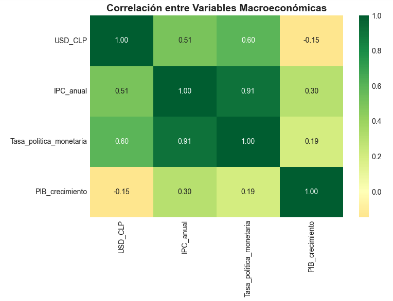

# Macroeconomic Analysis Chile 2018-2024

Analysis of key Chilean economic indicators using public data from the Banco Central de Chile.

---

## Tools
- **Python** — Pandas, Matplotlib, Seaborn

---

## Files
| File | Description |
|---|---|
| `proyecto2_banco_central.ipynb` | Main analysis notebook |
| `correlaciones.png` | Correlation heatmap |

---

## Key Findings

- The Chilean peso depreciated **47.4%** between 2018 and 2024
- Inflation peaked at **11.6% in 2022**, the highest in 30 years
- **Strong correlation (0.91)** between CPI and Monetary Policy Rate
- GDP collapsed **-6.1% in 2020** due to COVID-19, rebounded **+11.7% in 2021**
- The Central Bank raised rates aggressively from **0.5% (2020) to 11.25% (2022)**

---

## Author
**David Calderón** — Civil Computer Engineer 
